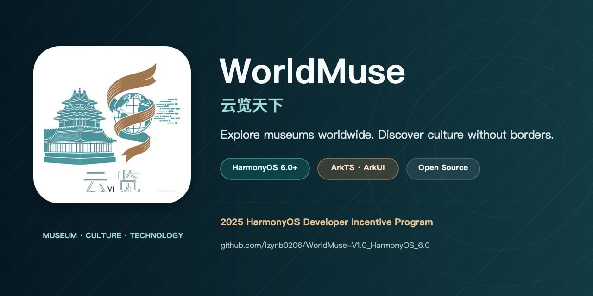
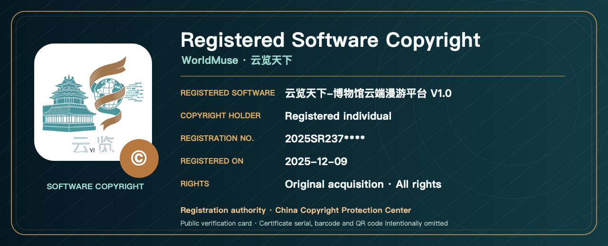
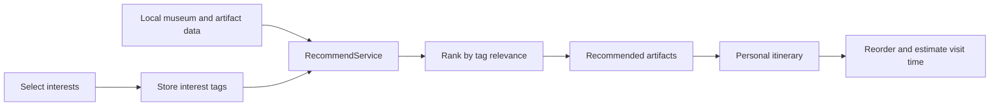

<div align="center">
  <a href="README.md"></a>
  <a href="README_CN.md"></a>
</div>

<br />

<div align="center">
  
</div>

<div align="center">
  <a href="https://github.com/lzynb0206/WorldMuse-V1.0_HarmonyOS_6.0/stargazers"></a>
  <a href="https://github.com/lzynb0206/WorldMuse-V1.0_HarmonyOS_6.0/network/members"></a>
  
  
  
</div>

<h1 align="center">WorldMuse · 云览天下</h1>

<p align="center">
  A native HarmonyOS museum discovery and cultural-learning experience.<br />
  Explore museums around the world, discover remarkable collections, and turn curiosity into a personal cultural journey.
</p>

## Overview

**WorldMuse** is an open-source HarmonyOS application built with ArkTS and ArkUI. It brings museum discovery, collection exploration, personalized recommendations, itinerary planning, cultural news, historical learning, and lightweight interactive tools into one mobile experience.

The project is designed around a simple idea: access to culture should not be limited by distance. Instead of presenting museum data as a static catalog, WorldMuse connects places, objects, stories, timelines, quizzes, achievements, and personal interests into a continuous exploration flow.

The application has been published on the HarmonyOS App Market and was selected for the **2025 HarmonyOS Developer Incentive Program**.

## At a Glance

| Item | Details |
| --- | --- |
| Product | Museum discovery and cultural-learning application |
| Platform | HarmonyOS 6.0+ |
| Current version | 1.0.0 |
| Language and UI | ArkTS · ArkUI |
| Target device | Phone |
| Data model | Local museum, artifact, event, game, and recommendation services |
| Storage | AppStorage and HarmonyOS Preferences |
| Build system | DevEco Studio · Hvigor |
| License | MIT |

## Intellectual Property

<div align="center">
  
</div>

WorldMuse has obtained a **Computer Software Copyright Registration Certificate** in China. The registered work covers the original V1.0 release of the museum cloud-roaming platform.

| Registration item | Details |
| --- | --- |
| Registered software | 云览天下-博物馆云端漫游平台 |
| Version | V1.0 |
| Copyright holder | Registered individual copyright holder |
| Acquisition and scope | Original acquisition · All rights |
| Registration No. | `2025SR237****` |
| Registration date | December 9, 2025 |
| Registration authority | China Copyright Protection Center |

> This is a privacy-safe project credential card, not a replacement for the official certificate. The copyright holder's name, complete registration number, certificate scan, certificate serial number, barcode, QR code, and official seal image are not stored in the public repository.

## Product Experience

WorldMuse is organized into four connected experiences:

1. **Discover** museums and artifacts through curated lists, regional filters, details, and cultural news.
2. **Personalize** the experience by selecting interests and receiving tag-based artifact recommendations.
3. **Plan** a museum journey by collecting recommendations into a reorderable itinerary with estimated visit time.
4. **Learn and interact** through historical timelines, quizzes, treasure hunts, achievements, and practical cultural tools.

## Features

### Museum Discovery

- Browse a curated collection of museums from different regions of the world.
- Open detailed museum pages with introductions, highlights, and associated collections.
- Filter and navigate content by region, category, and museum.
- Explore cultural news and open full news stories inside the application.

### Artifact Exploration

- Search and browse artifacts from the local collection dataset.
- View artifact descriptions, museum attribution, tags, and recommended viewing duration.
- Move naturally between museums, artifacts, recommendations, and personal routes.
- Save exploration progress through local HarmonyOS preferences where supported.

### Personalized Recommendations

- Select interests across culture, geography, history, and artifact categories.
- Match selected interests against artifact tags through `RecommendService`.
- Combine museum-specific results with popular artifacts for a broader recommendation list.
- Refresh interests at any time and generate a new selection.

### Personal Itinerary

- Add recommended artifacts to a personal museum itinerary.
- Group selected artifacts by museum.
- Reorder itinerary items with drag interactions.
- Remove items and review estimated visit time.
- Keep itinerary state locally through `AppStorage`.

### Learning and Interaction

- Follow major periods and events through a historical timeline.
- Test cultural knowledge with quiz content.
- Explore a lightweight treasure-hunt experience.
- Track progress through an achievements page.
- Use calendar, unit-conversion, and color-picker tools.

## Recommendation Flow



The current recommendation system is intentionally transparent and local. It calculates relevance from the overlap between the user's selected tags and the tags attached to each artifact, then supplements the result with popular items when needed. This makes the feature predictable, fast, and usable without depending on a remote recommendation API.

## Technology

| Layer | Technology |
| --- | --- |
| Operating system | HarmonyOS 6.0.1 / API 21 |
| Language | ArkTS |
| UI | ArkUI declarative components |
| Navigation | HarmonyOS Router |
| State | Component state, AppStorage, StorageLink |
| Persistence | HarmonyOS Preferences |
| Models | Museum, Artifact, Event, and Game models |
| Services | Museum, Artifact, Event, Game, and Recommendation services |
| Tooling | DevEco Studio, Hvigor |
| Testing dependencies | Hypium, Hamock |

## Project Structure

```text
Worldmuse_HarmonyOS/
├── AppScope/
│   ├── app.json5                       # App identity and version
│   └── resources/                      # App-level icons and resources
├── entry/
│   └── src/main/
│       ├── ets/
│       │   ├── entryability/           # Main HarmonyOS ability
│       │   ├── entrybackupability/     # Backup extension ability
│       │   ├── models/                 # Domain models
│       │   ├── pages/                  # Screens and interactions
│       │   ├── services/               # Local data and recommendation services
│       │   └── utils/                  # Shared utilities
│       └── resources/                  # Strings, media, profiles, and themes
├── docs/assets/                        # README covers and extracted app logo
├── scripts/                            # README asset generator
├── build-profile.json5                 # Build configuration without credentials
├── hvigorfile.ts
└── oh-package.json5
```

## Main Screens

| Area | Source page |
| --- | --- |
| Home and discovery | `Index.ets` |
| Museum list and details | `MuseumList.ets`, `MuseumDetail.ets` |
| Artifact browsing and details | `ArtifactExplore.ets`, `ArtifactDetail.ets` |
| Interest selection and recommendations | `InterestSelectPage.ets`, `RecommendPage.ets` |
| Personal itinerary | `MyItineraryPage.ets` |
| News and cultural stories | `News.ets`, `NewsDetail.ets` |
| Timeline, quiz, and treasure hunt | `Timeline.ets`, `Quiz.ets`, `TreasureHuntPage.ets` |
| Achievements and utilities | `Achievements.ets`, `ToolsPage.ets` |

## Getting Started

### Requirements

- DevEco Studio with HarmonyOS 6.0.1 support
- HarmonyOS SDK 6.0.1(21)
- A HarmonyOS emulator or phone
- Git

### Clone

```bash
git clone https://github.com/lzynb0206/WorldMuse-V1.0_HarmonyOS_6.0.git
cd WorldMuse-V1.0_HarmonyOS_6.0
```

### Run

1. Open the project directory in DevEco Studio.
2. Allow Hvigor to synchronize the project and install dependencies.
3. Select the `entry` module.
4. Choose a HarmonyOS emulator or connected device.
5. Run the application.

### Signing

This repository intentionally excludes developer certificates, private keys, signing profiles, passwords, and machine-specific paths. To run on a physical device or create a release build, configure your own signing identity in DevEco Studio.

Do not commit any generated signing files or local signing configuration.

## Local Data and Offline Use

Museum, artifact, event, quiz, and game content is primarily provided by local models, services, and packaged media resources. Core browsing, recommendation, itinerary, and learning flows can therefore operate without a dedicated backend. The module still declares Internet permission for experiences that may load network content.

## README Visuals

The project covers use the original high-resolution application icon from `AppScope/resources/base/media/startIcon.png`. Both language variants can be regenerated on macOS with:

```bash
SWIFT_MODULECACHE_PATH=/private/tmp/worldmuse-swift-cache \
CLANG_MODULE_CACHE_PATH=/private/tmp/worldmuse-clang-cache \
swift scripts/generate_readme_assets.swift
```

Generated assets:

- `docs/assets/worldmuse-project-card-en.png`
- `docs/assets/worldmuse-project-card-zh.png`
- `docs/assets/worldmuse-copyright-en.png`
- `docs/assets/worldmuse-copyright-zh.png`
- `docs/assets/worldmuse-logo.png`

## Security

- Signing certificates, keys, profiles, passwords, local properties, and generated signing material are ignored by Git.
- Never commit `项目证书/`, `material/`, `local.properties`, or private key files.
- If a real credential is accidentally committed, revoke or rotate it immediately before rewriting Git history.
- A force-push removes the content from reachable history, but existing forks, clones, or caches may still retain copies.

## Roadmap

- [ ] Expand museum and artifact datasets.
- [ ] Add in-app Chinese and English localization.
- [ ] Improve accessibility and large-font support.
- [ ] Add optional cloud synchronization for interests and itineraries.
- [ ] Expand automated tests for services and interaction flows.
- [ ] Continue improving tablet and multi-device layouts.

## Contributing

Issues, feature suggestions, and pull requests are welcome.

1. Fork the repository.
2. Create a focused feature branch.
3. Keep changes small and document important behavior.
4. Confirm that no credentials, machine paths, or build products are included.
5. Open a pull request describing the problem and the proposed solution.

## License

WorldMuse is released under the MIT License.

## Acknowledgements

WorldMuse was selected for the **2025 HarmonyOS Developer Incentive Program**. The project is dedicated to museums, researchers, educators, creators, and everyone working to make cultural knowledge easier to discover.

---

<p align="center">
  Museums without distance. Culture within reach.<br />
  <a href="README_CN.md">阅读简体中文版</a>
</p>
