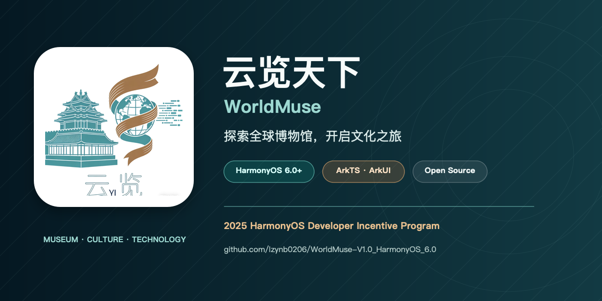

<div align="center">
  
</div>

<div align="center">
  <a href="https://github.com/lzynb0206/WorldMuse-V1.0_HarmonyOS_6.0/stargazers"></a>
  <a href="https://github.com/lzynb0206/WorldMuse-V1.0_HarmonyOS_6.0/network/members"></a>
  
  
  
</div>

<h1 align="center">云览天下 · WorldMuse</h1>

<p align="center">
  面向 HarmonyOS 的博物馆云端漫游平台<br />
  探索全球博物馆、走近珍贵藏品，在时间与文化之间开启一场随身旅程。
</p>

## 项目简介

**云览天下**是一款使用 ArkTS 与 ArkUI 开发的 HarmonyOS 原生应用。项目以博物馆与文化遗产为主线，将博物馆浏览、藏品探索、个性化推荐、参观路线规划和互动学习整合在同一套移动体验中。

项目已发布至鸿蒙应用市场，并入选 **2025 HarmonyOS Developer Incentive Program**。当前版本面向 HarmonyOS 6.0 及以上设备。

## 核心亮点

| 模块 | 能力 |
| --- | --- |
| 全球博物馆 | 按地区与类别浏览精选博物馆，查看馆藏与基本信息 |
| 藏品探索 | 搜索、筛选并查看藏品详情与文化背景 |
| 个性化推荐 | 根据用户选择的兴趣标签计算匹配度并推荐藏品 |
| 行程规划 | 将藏品加入参观路线，支持拖拽排序、删除与预计用时 |
| 文化资讯 | 集中浏览博物馆动态与文化资讯 |
| 历史学习 | 通过历史时间线、知识问答与寻宝游戏进行互动学习 |
| 成就系统 | 记录探索进度，让学习过程更具反馈感 |
| 实用工具 | 提供历史日历、单位换算与取色器等辅助功能 |

## 技术栈

- **操作系统：** HarmonyOS 6.0+
- **开发语言：** ArkTS
- **界面框架：** ArkUI
- **工程工具：** DevEco Studio、Hvigor
- **数据方式：** 本地数据与资源驱动，核心功能可离线使用
- **设备类型：** Phone

## 项目结构

```text
Worldmuse_HarmonyOS/
├── AppScope/                    # 应用级配置与图标资源
├── entry/
│   └── src/main/
│       ├── ets/
│       │   ├── pages/           # 页面与业务交互
│       │   ├── models/          # 数据模型
│       │   ├── services/        # 数据与业务服务
│       │   └── utils/           # 通用工具
│       └── resources/           # 图片、字符串与本地资源
├── build-profile.json5          # 工程构建配置（不包含签名凭据）
├── hvigorfile.ts
└── oh-package.json5
```

## 快速开始

### 环境要求

- DevEco Studio（支持 HarmonyOS 6.0.1 / API 21）
- HarmonyOS SDK 6.0.1(21)
- HarmonyOS 模拟器或真机

### 运行项目

```bash
git clone https://github.com/lzynb0206/WorldMuse-V1.0_HarmonyOS_6.0.git
cd WorldMuse-V1.0_HarmonyOS_6.0
```

1. 使用 DevEco Studio 打开项目目录。
2. 等待 Hvigor 同步并完成依赖安装。
3. 选择 HarmonyOS 模拟器或真机。
4. 运行 `entry` 模块。

> 仓库不包含开发者证书、私钥、签名 Profile 或本机路径。若需要真机调试或发布构建，请在 DevEco Studio 中配置你自己的签名信息。

## 推荐与路线规划

应用允许用户先选择感兴趣的文化、地域与藏品标签，再依据标签重合度生成个性化推荐。感兴趣的藏品可以加入参观路线，并进行拖拽排序、删除和预计时长管理；路线数据使用本地状态保存，便于离线使用。

## 隐私与安全

- 项目不会提交证书、私钥、签名 Profile、密码或本机配置。
- 请勿将 `项目证书/`、`material/`、`local.properties` 或任何密钥文件加入版本控制。
- 若历史提交中曾包含真实凭据，请立即在对应平台吊销并重新签发；仅从最新代码中删除并不能清除 Git 历史。

## 贡献

欢迎通过 Issue 提交建议或问题，也欢迎 Fork 项目并发起 Pull Request。提交代码前，请确保未包含本机路径、构建产物或任何签名材料。

## 许可证

本项目采用 MIT License 开源。

---

<p align="center">让博物馆不再受距离限制，让文化探索随时发生。</p>
