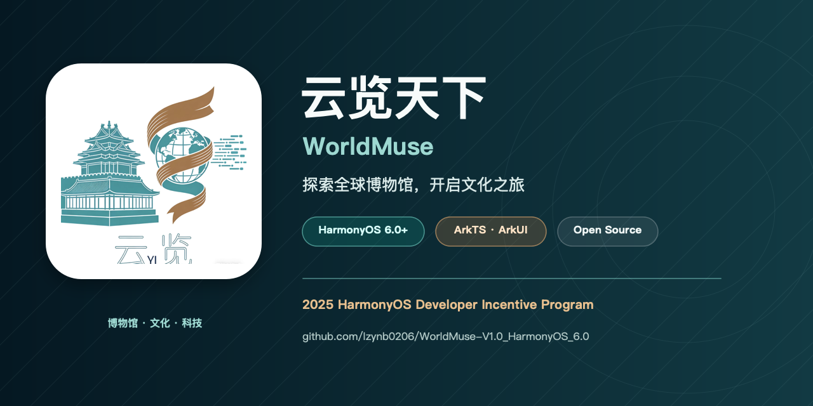

<div align="center">
  <a href="README.md"></a>
  <a href="README_CN.md"></a>
</div>

<br />

<div align="center">
  
</div>

<div align="center">
  <a href="https://github.com/lzynb0206/WorldMuse-V1.0_HarmonyOS_6.0/stargazers"></a>
  <a href="https://github.com/lzynb0206/WorldMuse-V1.0_HarmonyOS_6.0/network/members"></a>
  
  
  
</div>

<h1 align="center">云览天下 · WorldMuse</h1>

<p align="center">
  面向 HarmonyOS 的原生博物馆探索与文化学习应用。<br />
  探索全球博物馆、走近珍贵藏品，让每一次好奇都成为一段专属文化旅程。
</p>

## 项目简介

**云览天下（WorldMuse）**是一款使用 ArkTS 与 ArkUI 开发的开源 HarmonyOS 应用。项目将博物馆浏览、藏品探索、个性化推荐、参观路线规划、文化资讯、历史学习和轻量互动工具整合在同一套移动体验中。

项目围绕一个简单的理念展开：文化知识不应受到距离限制。云览天下并不只是把博物馆资料做成静态目录，而是将地点、藏品、故事、历史时间线、知识问答、成就系统和用户兴趣连接为一条连续的探索路径。

应用已发布至鸿蒙应用市场，并入选 **2025 HarmonyOS Developer Incentive Program**。

## 项目信息

| 项目 | 说明 |
| --- | --- |
| 产品定位 | 博物馆探索与文化学习应用 |
| 运行平台 | HarmonyOS 6.0+ |
| 当前版本 | 1.0.0 |
| 开发语言与界面 | ArkTS · ArkUI |
| 目标设备 | Phone |
| 数据模型 | 本地博物馆、藏品、历史事件、游戏与推荐服务 |
| 状态存储 | AppStorage 与 HarmonyOS Preferences |
| 构建工具 | DevEco Studio · Hvigor |
| 开源协议 | MIT |

## 产品体验

云览天下把主要体验组织为四条彼此衔接的路径：

1. **发现：**通过精选列表、区域筛选、详情页面和文化资讯了解博物馆与藏品。
2. **个性化：**选择兴趣标签，并根据标签相关度获得藏品推荐。
3. **规划：**把推荐藏品加入参观路线，调整顺序并查看预计参观时间。
4. **学习与互动：**通过历史时间线、知识问答、寻宝游戏、成就系统和文化工具持续探索。

## 功能介绍

### 全球博物馆

- 浏览来自不同国家与地区的精选博物馆。
- 进入博物馆详情页查看介绍、代表藏品与相关信息。
- 根据地区、分类与博物馆维度筛选和跳转内容。
- 浏览文化资讯，并进入完整资讯详情页面。

### 藏品探索

- 在本地藏品数据集中搜索与浏览文化藏品。
- 查看藏品说明、所属博物馆、兴趣标签及预计参观时长。
- 在博物馆、藏品、推荐结果和个人路线之间自然跳转。
- 使用 HarmonyOS Preferences 保存部分探索进度与用户数据。

### 个性化推荐

- 从文化、地域、历史和藏品类型等维度选择兴趣标签。
- 通过 `RecommendService` 计算兴趣标签与藏品标签的匹配程度。
- 在博物馆匹配结果之外补充热门藏品，使推荐结果更加丰富。
- 随时重新选择兴趣并生成新的推荐列表。

### 专属参观路线

- 将感兴趣的推荐藏品加入个人行程。
- 按博物馆自动整理已选择的藏品。
- 通过拖拽交互调整路线顺序。
- 删除行程项目并统计预计参观时长。
- 使用 `AppStorage` 在本地保存行程状态。

### 历史学习与互动

- 通过历史时间线了解重要时期与事件。
- 使用知识问答检验文化知识。
- 体验轻量化寻宝玩法。
- 在成就页面记录探索进度。
- 使用历史日历、单位换算与取色器等实用工具。

## 推荐系统流程


当前推荐系统采用透明的本地规则：计算用户兴趣标签与每件藏品标签的重合程度，并在结果不足时加入热门内容。整个过程不依赖远程推荐接口，因此响应快速、结果可解释，也能支持离线使用。

## 技术实现

| 层级 | 技术 |
| --- | --- |
| 操作系统 | HarmonyOS 6.0.1 / API 21 |
| 开发语言 | ArkTS |
| 界面框架 | ArkUI 声明式组件 |
| 页面导航 | HarmonyOS Router |
| 状态管理 | 组件状态、AppStorage、StorageLink |
| 数据持久化 | HarmonyOS Preferences |
| 数据模型 | Museum、Artifact、Event、Game |
| 服务层 | Museum、Artifact、Event、Game、Recommend Service |
| 工程工具 | DevEco Studio、Hvigor |
| 测试依赖 | Hypium、Hamock |

## 项目结构

```text
Worldmuse_HarmonyOS/
├── AppScope/
│   ├── app.json5                       # 应用身份与版本信息
│   └── resources/                      # 应用级图标与资源
├── entry/
│   └── src/main/
│       ├── ets/
│       │   ├── entryability/           # HarmonyOS 主 Ability
│       │   ├── entrybackupability/     # 备份扩展 Ability
│       │   ├── models/                 # 领域数据模型
│       │   ├── pages/                  # 页面与交互逻辑
│       │   ├── services/               # 本地数据和推荐服务
│       │   └── utils/                  # 通用工具
│       └── resources/                  # 字符串、媒体、配置与主题
├── docs/assets/                        # 双语 README 封面和应用图标
├── scripts/                            # README 视觉资源生成脚本
├── build-profile.json5                 # 不包含签名凭据的构建配置
├── hvigorfile.ts
└── oh-package.json5
```

## 主要页面

| 功能区域 | 对应页面 |
| --- | --- |
| 首页与内容发现 | `Index.ets` |
| 博物馆列表与详情 | `MuseumList.ets`、`MuseumDetail.ets` |
| 藏品浏览与详情 | `ArtifactExplore.ets`、`ArtifactDetail.ets` |
| 兴趣选择与个性化推荐 | `InterestSelectPage.ets`、`RecommendPage.ets` |
| 个人参观路线 | `MyItineraryPage.ets` |
| 资讯与文化故事 | `News.ets`、`NewsDetail.ets` |
| 时间线、问答和寻宝 | `Timeline.ets`、`Quiz.ets`、`TreasureHuntPage.ets` |
| 成就与实用工具 | `Achievements.ets`、`ToolsPage.ets` |

## 快速开始

### 环境要求

- 支持 HarmonyOS 6.0.1 的 DevEco Studio
- HarmonyOS SDK 6.0.1(21)
- HarmonyOS 模拟器或真机
- Git

### 克隆项目

```bash
git clone https://github.com/lzynb0206/WorldMuse-V1.0_HarmonyOS_6.0.git
cd WorldMuse-V1.0_HarmonyOS_6.0
```

### 运行项目

1. 使用 DevEco Studio 打开项目目录。
2. 等待 Hvigor 完成工程同步与依赖安装。
3. 选择 `entry` 模块。
4. 选择 HarmonyOS 模拟器或已连接的真机。
5. 运行应用。

### 签名配置

本仓库不会包含开发者证书、私钥、签名 Profile、密码或本机路径。如需真机调试或生成发布版本，请在 DevEco Studio 中配置属于你自己的签名身份。

请勿提交 DevEco Studio 生成的签名文件或本地签名配置。

## 本地数据与离线能力

博物馆、藏品、历史事件、问答和游戏内容主要来自项目内的模型、服务与媒体资源。因此，浏览、推荐、路线规划和学习等核心流程不依赖专用后端，可以在离线环境下使用。模块仍然声明了网络权限，用于可能需要加载在线内容的功能。

## README 双语封面

项目封面使用 `AppScope/resources/base/media/startIcon.png` 中的高清应用图标生成。可在 macOS 中执行以下命令重新生成中英文版本：

```bash
SWIFT_MODULECACHE_PATH=/private/tmp/worldmuse-swift-cache \
CLANG_MODULE_CACHE_PATH=/private/tmp/worldmuse-clang-cache \
swift scripts/generate_readme_assets.swift
```

生成的资源包括：

- `docs/assets/worldmuse-project-card-en.png`
- `docs/assets/worldmuse-project-card-zh.png`
- `docs/assets/worldmuse-logo.png`

## 安全说明

- Git 已忽略签名证书、私钥、Profile、密码、本机配置与签名生成材料。
- 请勿提交 `项目证书/`、`material/`、`local.properties` 或任何私钥文件。
- 如果真实凭据被误提交，应先在对应平台吊销或更换，再清理 Git 历史。
- 强制改写可以清除可达历史，但已有 Fork、克隆或缓存中仍可能保留旧副本。

## 后续计划

- [ ] 扩充博物馆与藏品数据集。
- [ ] 增加应用内中英文国际化。
- [ ] 改进无障碍体验与大字体适配。
- [ ] 为兴趣和行程增加可选的云端同步。
- [ ] 为服务层与交互流程补充自动化测试。
- [ ] 持续完善平板与多设备布局。

## 参与贡献

欢迎提交 Issue、功能建议或 Pull Request。

1. Fork 本仓库。
2. 创建目标明确的功能分支。
3. 保持改动范围清晰，并记录重要行为。
4. 确认提交中不包含凭据、本机路径或构建产物。
5. 发起 Pull Request，并说明问题和解决方案。

## 开源协议

WorldMuse 采用 MIT License 开源。

## 致谢

云览天下入选了 **2025 HarmonyOS Developer Incentive Program**。谨向所有推动文化知识传播的博物馆、研究者、教育工作者、创作者与开发者致谢。

---

<p align="center">
  让博物馆不再受距离限制，让文化探索随时发生。<br />
  <a href="README.md">Read the English version</a>
</p>
